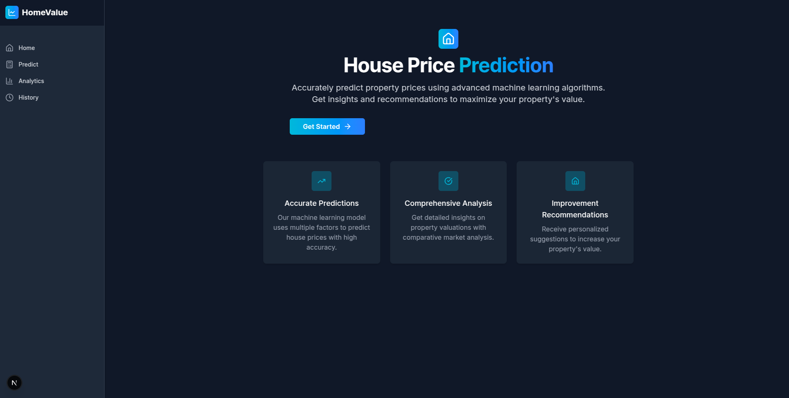
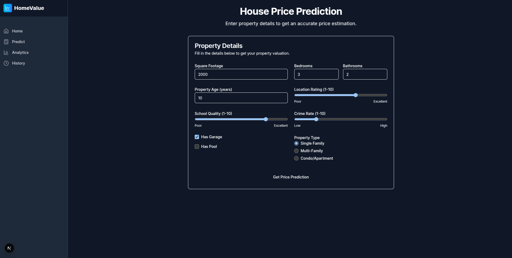
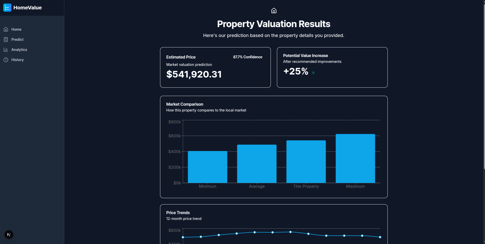

# House Price Prediction

## Overview
This is a Next.js-based frontend application for predicting house prices. The application provides an intuitive interface for users to input property details and receive price predictions, view historical predictions, and analyze trends.

## Features

- **Home Page**: Displays a record of past predictions made by the user.

- **Prediction Page**: Allows users to input property features and get real-time price predictions.

- **Analytics Dashboard**: Provides visual insights and trends based on prediction data.

- **Responsive Design**: Built with a mobile-first approach for optimal viewing on all devices.

## Folder Structure

```
app/
├── analytics/            # Analytics dashboard components
├── history/              # User prediction history page
├── predict/              # Main prediction page
├── results/              # Prediction results display
├── favicon.ico           # Website icon
├── globals.css           # Global styles
├── layout.tsx            # Main application layout
├── page.tsx              # Home page
components/               # Reusable UI components
lib/                      # Utility functions and libraries
node_modules/             # Project dependencies
providers/
├── app-providers.tsx     # Context providers for the app
public/                   # Static assets
services/
├── prediction.service.ts # Service for prediction API calls
types/
├── index.ts              # TypeScript type definitions
.gitignore                # Git ignore rules
next-env.d.ts             # Next.js TypeScript declarations
```

## Getting Started

### Prerequisites
- Node.js (v14 or later)
- npm or yarn

### Installation
1. Clone the repository:
   ```bash
   git clone <repository-url>
   ```
2. Navigate to the project directory:
   ```bash
   cd houseprice-prediction-frontend
   ```
3. Install dependencies:
   ```bash
   npm install
   # or
   yarn install
   ```

### Running the Application
Start the development server:
```bash
npm run dev
# or
yarn dev
```
Open [http://localhost:3000](http://localhost:3000) in your browser to view the application.

## Technologies Used
- **Next.js**: React framework for server-side rendering and static site generation.
- **TypeScript**: For type-safe development.
- **Tailwind CSS**: Utility-first CSS framework for styling.
- **React Query**: For data fetching and state management.

## API Integration
The frontend communicates with a backend prediction service (configured in `services/prediction.service.ts`) to fetch house price predictions.

## Contributing
Contributions are welcome! Please fork the repository and submit a pull request with your changes.

## License
This project is licensed under the MIT License. See the [LICENSE](LICENSE) file for details.

---

For any questions or issues, please open an issue in the repository.